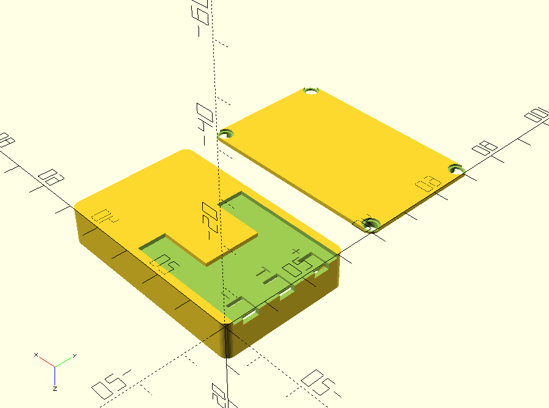

# Canon-NB1L-battery-case
The outer shell to fit a Canon NB1L battery as found in a Canon Digital Ixus camera

This just creates a 3D printable shell to fit in place of the battery, ready for springy contacts. 
I'm using it with an external power supply, maybe you could find a Li-Po cell with on-board protection and temp sensor to fit.
Do *NOT* use a cell without a protection board!

##Requirements
This module needs my project box library to run.
This can be found at https://github.com/JennyList/Jennys-rectangular-project-box

You'll find two parts, the box and the lid. Print with supports over the bed.
You'll also need four small self-tapping screws to assemble it.
 

## Licence

This library is licensed under the [Creative Commons Attribution Share Alike 4.0 International licence](license.md).
